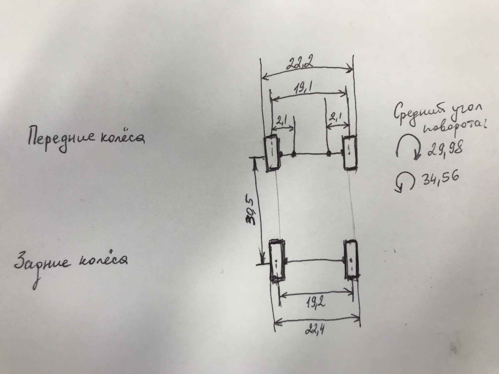

Масса колеса - 56 г.
Масса машинки (полная, с колёсами) - 5.260 кг
Примерная масса без колёс - 5.036 кг
Передаточное число (от 4х колёс к велосипедной модели) = 0,105
Большая шестерня 46 зубьев 
Малая шестерня 15 зубьев 
Передаточное число 3,067
Развал колес симметричен 
Габаритная длина 416 мм
Колесная база (см. фото, единицы измерения - см)
 

Угол поворота СРЕДНЕГО колеса (max налево)   = 28 градусов
Угол поворота СРЕДНЕГО колеса (max направо) = 34 градуса  

