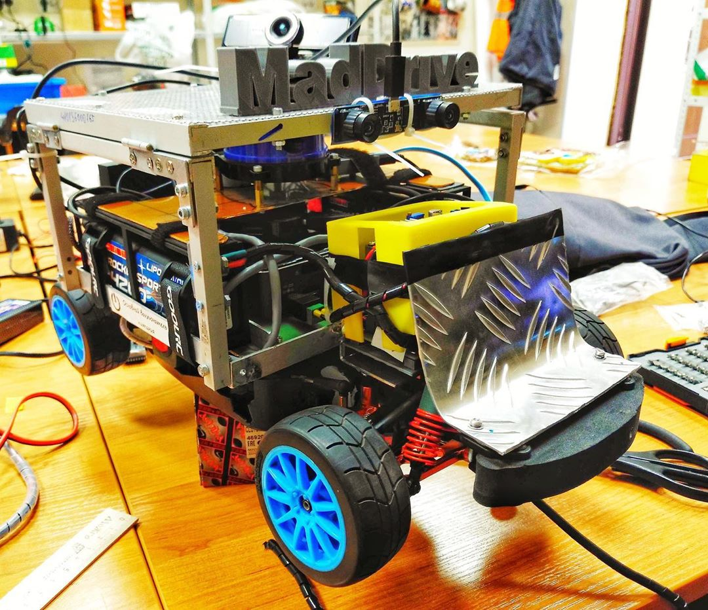
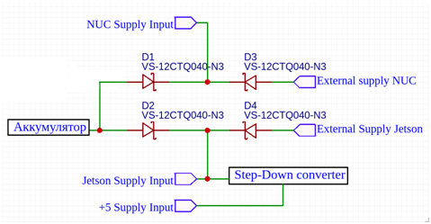
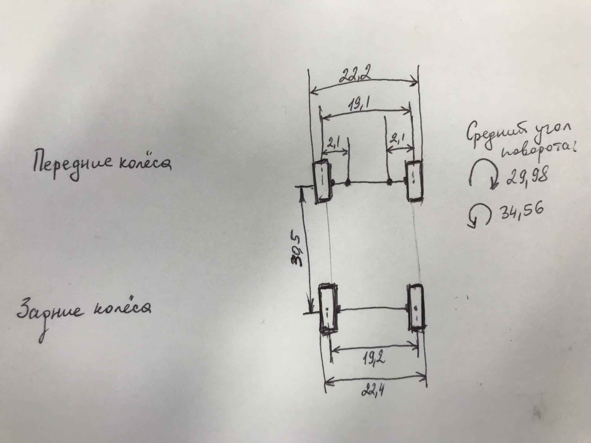

# Описание проекта zaWRka

- [Параметры сервопривода](#параметры-сервопривода)
- [Система питания машинки](#система-питания-машинки)
- [Параметры аккумулятора двигателя (нижний уровень)](#параметры-аккумулятора-двигателя-нижний-уровень)
- [Основные параметры машинки](#основные-параметры-машинки)
- [Вычислительная аппаратура + сенсорика](#вычислительная-аппаратура--сенсорика)
- [Программное обеспечение](#программное-обеспечение)
- [Архитектура (ROS)](#архитектура-ros)
- [Архитектура (uC)](#архитектура-uc)
- [Autonet 2020 - вредные советы](#autonet-2020---вредные-советы)
  - [Идеи для улучшения](#идеи-для-улучшения)
  - [Репозиторий для соревнований](#репозиторий-для-соревнований)
  - [Инфа по соревнованиям](#инфа-по-соревнованиям)
    - [Интересное](#интересное)
    - [Инфа о машинке](#инфа-о-машинке)
    - [Этапы проверки - не проканает на этих соревнованиях =(](#этапы-проверки---не-проканает-на-этих-соревнованиях-)
    - [Что сделать после](#что-сделать-после)
- [Сопутствующие доки](#сопутствующие-доки)

Проект выполнен на основе ралийной платформы [WR8 Flux](https://www.hpiracing.com/ru/kit/107113).

В ходе работы родной двигатель Hobbywing Xerun 21.5T был заменен на ???.

Для управления двигателем используется [ESC](https://p11.secure.hostingprod.com/@hobbypartz.com/ssl/ibuyrc/manual/07E-JUSTOCK.pdf) [Hobbywing Justock Club](https://www.amainhobbies.com/hobbywing-justock-club-spec-sensored-brushless-esc-blue-hwa81020000/p279089).

Для получения информации о вращении двигателя к валу двигателя подключен энкодер [HEDS-5540#A06](https://www.chipdip.ru/product/heds-5540-a06).

## Параметры сервопривода

Сервопривод рулевых колес был заменен на [MG958 | Tower Pro](http://www.towerpro.com.tw/product/mg958/):

- В сервоприводе было определено передаточное число редуктора = 1/9

| Параметр                         | Значение  |
| -------------------------------- | --------- |
| Длина, мм                        | 40.2      |
| Ширина, мм                       | 20.1      |
| Высота, мм                       | 36.8      |
| Operating Voltage, V             | 4.8—6.6   |
| Stall Torque (4.8 V), kg cm      | 18.0      |
| Stall Torque (6.6 V), kg cm      | 20.0      |
| Вес, г                           | 65        |
| Operating Temperature range, ºC  | 0 ~ +55ºC |
| Operating Speed (4.8 V), sec/60º | 0.18      |
| Operating Speed (6.6 V), sec/60º | 0.15      |
| Current draw at IDLE             | 10 mA     |
| No load operating current draw   | 170 mA    |
| Stall current draw               | 1600 mA   |

## Система питания машинки

Для удобной отладки был разработан модуль внешнего питания по следующей схеме:

Данный модуль позволил производить горячее отключение/подключение питания основных вычислителей и составляющих.

Для обеспечения необходимых уровней напряжения питания в подсистеме питания используется понижающий преобразователь на базе микросхемы LM2596 для получения 5 В.

## Параметры аккумулятора двигателя (нижний уровень)

Источник питания (нижний уровень = двигатель + ESC, серва, радиоприёмник): [аккумулятор LiPo 2S 3300 mAh](https://rc-like.ru/akkumulyator-enrichpower-lipo-7-4v-2s-50c-3300-mah-rbc-0081-01)

| Параметр         | Значение |
| ---------------- | -------- |
| Тип              | LiPo     |
| Длина            | мм,138   |
| Ширина           | мм,46    |
| Высота           | мм,25    |
| Напряжение, В    | 7,4      |
| Количество ячеек | 2S       |
| Ёмкость, мАч     | 3300     |
| Токоотдача       | 50С      |

## Основные параметры машинки

| Параметр                                               | Значение    |
| ------------------------------------------------------ | ----------- |
| Масса колеса                                           | 56 г.       |
| Масса машинки (полная, с колёсами)                     | 5.260 кг    |
| Примерная масса без колёс                              | 5.036 кг    |
| Передаточное число (от 4х колёс к велосипедной модели) | 0,105       |
| Большая шестерня                                       | 46 зубьев   |
| Малая шестерня                                         | 15 зубьев   |
| Передаточное число                                     | 3,067       |
| Развал колес                                           | симметричен |
| Габаритная длина                                       | 416 мм      |
| Угол поворота СРЕДНЕГО колеса (max налево)             | 28 градусов |
| Угол поворота СРЕДНЕГО колеса (max направо)            | 34 градуса  |

Колесная база (см. фото, единицы измерения - см)

## Вычислительная аппаратура + сенсорика

На машинке используется:

- лидар [YDLIDAR X4](https://www.robotshop.com/en/ydlidar-x4-360-laser-scanner.html)
- микроконтроллер [STM32F767ZI](https://www.st.com/en/microcontrollers-microprocessors/stm32f767zi.html) плата [Nucleo](https://www.st.com/en/evaluation-tools/nucleo-f767zi.html)
- компьютер [NUC7I5BNK](https://www.intel.ru/content/www/ru/ru/products/boards-kits/nuc/kits/nuc7i5bnk.html)
- камеры (использовали разные):
    - ELP 3.0 Megapixel USB CAMERA
    - Logitech C270
    - Genius WideCam F100
    - [ELP Stereo Camera](https://www.amazon.com/ELP-Industrial-Application-Synchronized-ELP-960P2CAM-V90-VC/dp/B078TDLHCP)

## Программное обеспечение

[GitHub - lsd-maddrive/zaWRka-project](https://github.com/lsd-maddrive/zaWRka-project)

В качестве основы использован фреймворк [ROS](https://www.ros.org/).

[zaWRka Media](https://disk.yandex.ru/d/HvQgwCIF9kUtJQ?w=1)

[ZaWRka, Sir](https://www.youtube.com/playlist?list=PLdRYu473gKJQZONYzMcqeCjQqaw7AoMUb)

## [Архитектура (ROS)](zaWRka-ROS.v3.drawio)

## [Архитектура (uC)](zaWRka-uC.v1.drawio)

## Autonet 2020 - вредные советы

- Придерживаться расписания / Составлять расписание с запасом
- Мы не видели баллов и результатов

### Идеи для улучшения

- Сделать макет лабиринта
- Сделать макет светофора

### Репозиторий для соревнований

Так как машинка предоставлялась, проще было сделать [отдельный репозиторий](https://github.com/lsd-maddrive/autonet18p2020_MadDrive) для решения:

### Инфа по соревнованиям

#### Интересное

[http://datagenetics.com/blog/december22016/index.html](http://datagenetics.com/blog/december22016/index.html)

[http://ckw.phys.ncku.edu.tw/public/pub/Notes/GeneralPhysics/Powerpoint/Extra/05/11_0_0_Steering_Theroy.pdf](http://ckw.phys.ncku.edu.tw/public/pub/Notes/GeneralPhysics/Powerpoint/Extra/05/11_0_0_Steering_Theroy.pdf)

[https://answers.gazebosim.org//question/13670/simulate-odometry-with-ackermann-locomotion/](https://answers.gazebosim.org//question/13670/simulate-odometry-with-ackermann-locomotion/)

[https://github.com/atomoclast/ros_mono_vo](https://github.com/atomoclast/ros_mono_vo)

[https://habr.com/ru/post/493792/](https://habr.com/ru/post/493792/)

MPC - model predictive control

[https://www.youtube.com/watch?v=N_L3MuPEHa8](https://www.youtube.com/watch?v=N_L3MuPEHa8)

#### Инфа о машинке

Машинка:

- Лидар располагается точно над передней осью посередине
- Межосевое расстояние - 340 мм → $L$
- Диаметр поворота - 145 см → $D=2*R$
- Максимальный угол - ~25 → $\gamma=atan(L/R)$
- Нижняя камера на 110мм от передней оси вперёд на высоте 85
- Верхняя камера 70мм от передней оси назад 215мм высота

Параметры в пакете используются в

- Gazebo
- Планер (конфиг прямоугольника)
    - costmap_common_params.yaml - footprint
    - teb_local_planner_params.yaml - footprint_model/vertices
- Модель оценки одометрии по команде

#### Этапы проверки - не проканает на этих соревнованиях =(

- Проверить, что карта сходится с реальным лабиринтом, прокатить на ручном управлении и в местах проблем устанавливать положение через rviz
- Записать bag файлы со следующими данными:
- Сканы лидара
- Оценка lsm
- Команды move_base
- Карты стоимостей
- Видео с камер

#### Что сделать после

- [ ]  Сделать пакет для робота (для firmware)
- [ ]  Поправить описание (readme)
- [ ]  Line_detector - вынести в отдельный пакет
- [ ]  Sign_detector + color_detector - вынести в отдельный пакет
- [ ]  Скрипты с sim переименовать в dev

## Сопутствующие доки

- [Инженерные книги](books)
- [Презентации](presentations)

> Страница основы: https://lavish-podium-945.notion.site/zaWRka-dfa99b1ef3d7416baf58061de0b1fc23
